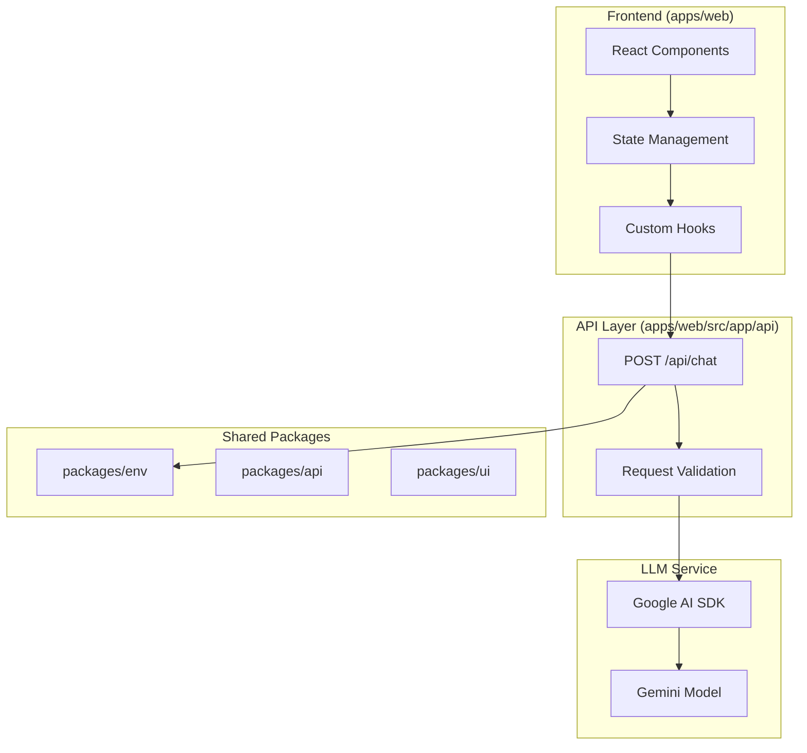
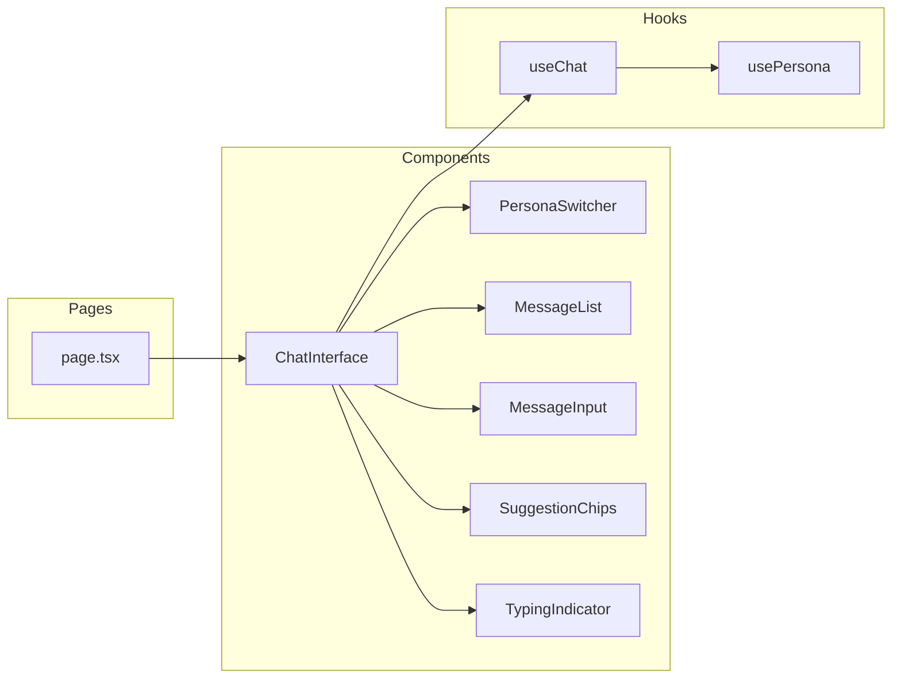

# Design Document: Persona-Based AI Chatbot

## Overview

The Persona-Based AI Chatbot is a Next.js web application that enables users to have conversations with three distinct AI personas modeled after Scaler/InterviewBit personalities. Each persona has a unique system prompt that defines their communication style, expertise, and behavior.

### Goals

1. Provide a chat interface where users can interact with AI personas
2. Support switching between three distinct personas (Anshuman Singh, Abhimanyu Saxena, Kshitij Mishra)
3. Deliver persona-authentic responses using Google AI SDK
4. Ensure a responsive, accessible user experience across devices

### Scope

- **In Scope**: Chat UI, persona switching, LLM integration, suggestion chips, typing indicator, mobile responsiveness
- **Out of Scope**: User authentication, persistent conversation storage, multi-language support, voice input

---

## Architecture

### System Architecture Diagram



### Component Architecture



### Data Flow

1. **User sends message**: User types in input field → `MessageInput` component
2. **State update**: `useChat` hook adds user message to state, displays immediately
3. **API call**: `useChat` calls `/api/chat` with message, personaId, and history
4. **LLM processing**: API route selects system prompt based on personaId, calls Google AI
5. **Response streaming**: LLM response streams back to client
6. **UI update**: `useChat` processes stream, adds assistant message to state

---

## Components and Interfaces

Using AI Elements components from `.kiro/skills/ai-elements/references/`:

### Frontend Components (AI Elements)

#### ChatInterface (Main Container)

Using AI Elements `Conversation` + `PromptInput` components:

```typescript
// apps/web/src/components/chat-interface.tsx
"use client";

import {
  Conversation,
  ConversationContent,
  ConversationScrollButton,
} from "@/components/ai-elements/conversation";
import {
  Message,
  MessageContent,
  MessageResponse,
} from "@/components/ai-elements/message";
import {
  PromptInput,
  type PromptInputMessage,
  PromptInputTextarea,
  PromptInputSubmit,
} from "@/components/ai-elements/prompt-input";
import { useChat } from "@ai-sdk/react";

interface ChatInterfaceProps {
  personaId: "anshuman" | "abhimanyu" | "kshitij";
}

export function ChatInterface({ personaId }: ChatInterfaceProps) {
  const { messages, sendMessage, status } = useChat({
    api: "/api/chat",
  });

  const handleSubmit = (message: PromptInputMessage) => {
    if (message.text.trim()) {
      sendMessage({ text: message.text });
    }
  };

  return (
    <Conversation>
      <ConversationContent>
        {messages.map((message) => (
          <Message from={message.role} key={message.id}>
            <MessageContent>
              {message.parts.map((part, i) => {
                if (part.type === "text") {
                  return <MessageResponse key={`${message.id}-${i}`}>{part.text}</MessageResponse>;
                }
                return null;
              })}
            </MessageContent>
          </Message>
        ))}
      </ConversationContent>
      <ConversationScrollButton />
      <PromptInput onSubmit={handleSubmit}>
        <PromptInputTextarea placeholder="Ask me anything..." />
        <PromptInputSubmit status={status} />
      </PromptInput>
    </Conversation>
  );
}
```

#### PersonaSwitcher

Using AI Elements `Persona` component with state management:

```typescript
// apps/web/src/components/persona-switcher.tsx
"use client";

import { Persona } from "@/components/ai-elements/persona";
import { useChat } from "@ai-sdk/react";

interface PersonaSwitcherProps {
  personas: Persona[];
  selectedPersonaId: string;
  onSelect: (personaId: string) => void;
}

// Persona states: "idle" | "listening" | "thinking" | "speaking" | "asleep"
// Variants: "obsidian" | "mana" | "opal" | "halo" | "glint" | "command"
export function PersonaSwitcher({ personas, selectedPersonaId, onSelect }: PersonaSwitcherProps) {
  const { status } = useChat();

  // Map chat status to persona state
  const getPersonaState = () => {
    switch (status) {
      case "streaming":
        return "speaking";
      case "submitted":
        return "thinking";
      default:
        return "idle";
    }
  };

  return (
    <div className="flex gap-4">
      {personas.map((persona) => (
        <button key={persona.id} onClick={() => onSelect(persona.id)}>
          <Persona
            state={selectedPersonaId === persona.id ? getPersonaState() : "idle"}
            variant="obsidian"
            className={selectedPersonaId === persona.id ? "border-primary" : ""}
          />
          <span>{persona.name}</span>
        </button>
      ))}
    </div>
  );
}
```

#### Suggestion Chips

Using AI Elements `Suggestions` and `Suggestion` components:

```typescript
// apps/web/src/components/suggestion-chips.tsx
"use client";

import { Suggestion, Suggestions } from "@/components/ai-elements/suggestion";
import { useChat } from "@ai-sdk/react";

interface SuggestionChipsProps {
  suggestions: string[];
  hidden?: boolean;
}

export function SuggestionChips({ suggestions, hidden }: SuggestionChipsProps) {
  const { sendMessage } = useChat();

  if (hidden) return null;

  return (
    <Suggestions>
      {suggestions.map((suggestion) => (
        <Suggestion
          key={suggestion}
          suggestion={suggestion}
          onClick={(text) => sendMessage({ text })}
        />
      ))}
    </Suggestions>
  );
}
```

### Chat SDK Integration

The project uses Chat SDK for chat layer (message handling, thread management):

```typescript
// Using Chat SDK for web chat
import { Chat } from "chat";
import { createWebAdapter } from "@chat-adapter/web";

// Create a web-based chat bot
const bot = new Chat({
  userName: "persona-chatbot",
  adapters: {
    web: createWebAdapter(), // Web adapter for browser-based chat
  },
});

// Subscribe to messages in a thread
bot.onNewMention(async (thread) => {
  await thread.subscribe();
  await thread.post("Hello! I'm your AI persona assistant.");
});

// Handle incoming messages
bot.onSubscribedMessage(async (thread, message) => {
  // Process message and get AI response
  const response = await getPersonaResponse(message.text, currentPersona);
  await thread.post(response);
});
```

### AI SDK Integration

The project uses AI SDK for LLM calls:

```typescript
// Using AI SDK for LLM integration
import { streamText } from "ai";
import { google } from "@ai-sdk/google";

const result = streamText({
  model: google("gemini-2.5-flash"),
  system: personaSystemPrompt,
  messages: convertToModelMessages(chatHistory),
});

return result.toUIMessageStreamResponse();
```

### AI Elements Components

The project uses pre-built AI Elements components (no custom UI code needed):

| Component      | Purpose                        | npm Package |
| -------------- | ------------------------------ | ----------- |
| `Conversation` | Message list with auto-scroll  | ai-elements |
| `Message`      | User/assistant message display | ai-elements |
| `PromptInput`  | Text input with submit         | ai-elements |
| `Persona`      | Animated AI visual with states | ai-elements |
| `Suggestion`   | Quick-start question chips     | ai-elements |

### Custom Hooks

#### usePersona (Custom - System Prompt Management)

```typescript
// apps/web/src/hooks/use-persona.ts
interface UsePersonaReturn {
  currentPersona: Persona;
  switchPersona: (personaId: Persona["id"]) => void;
  systemPrompt: string;
}

function usePersona(initialPersonaId?: Persona["id"]): UsePersonaReturn;
```

---

## Data Models

### Message Model

```typescript
interface ChatMessage {
  id: string; // UUID
  role: "user" | "assistant";
  content: string;
  timestamp: string; // ISO 8601
}
```

### API Request Model

```typescript
// POST /api/chat
interface ChatRequest {
  message: string; // Required, non-empty
  personaId: "anshuman" | "abhimanyu" | "kshitij";
  history?: ChatMessage[]; // Optional, for context
}
```

### API Response Model

```typescript
// Success response
interface ChatResponse {
  response: string;
}

// Error response
interface ErrorResponse {
  error: string;
  code?: string;
}
```

### Persona System Prompt Structure

Each persona has a system prompt containing:

```typescript
interface PersonaSystemPrompt {
  description: string; // Background, values, communication style
  fewShotExamples: Array<{
    // Minimum 3 examples
    user: string;
    response: string;
  }>;
  chainOfThought: string; // Step-by-step reasoning instruction
  outputFormat: {
    // Response format specification
    maxLength?: number;
    endingStyle: "question" | "statement" | "both";
  };
  constraints: string[]; // What the persona should never do
}
```

### Suggestion Chips Model

```typescript
interface SuggestionChips {
  anshuman: string[];
  abhimanyu: string[];
  kshitij: string[];
}
```

---

## API Design

### POST /api/chat

**Endpoint**: `POST /api/chat`

**Request Headers**:

- `Content-Type: application/json`

**Request Body**:

```json
{
  "messages": [
    {
      "id": "msg-1",
      "role": "user",
      "parts": [
        {
          "type": "text",
          "text": "How do I prepare for system design interviews?"
        }
      ]
    }
  ]
}
```

**Success Response** (200): Streamed text response using `toUIMessageStreamResponse()`

**Error Responses**:

- 400: Invalid request body
- 500: Internal server error

### API Implementation (AI SDK Pattern)

Following the AI SDK best practices from the ai-sdk skill and Context7 documentation:

```typescript
// apps/web/src/app/api/chat/route.ts
import { google } from "@ai-sdk/google";
import {
  convertToModelMessages,
  streamText,
  type UIMessage,
  validateUIMessages,
} from "ai";
import { z } from "zod";

export const maxDuration = 30;

const requestSchema = z.object({
  messages: z.array(z.unknown()),
});

export async function POST(req: Request) {
  let body: unknown;

  try {
    body = await req.json();
  } catch {
    return Response.json({ error: "Invalid JSON body" }, { status: 400 });
  }

  const parsed = requestSchema.safeParse(body);

  if (!parsed.success) {
    return Response.json({ error: "Invalid request body" }, { status: 400 });
  }

  try {
    const messages = await validateUIMessages<UIMessage>({
      messages: parsed.data.messages,
    });

    const result = streamText({
      model: google("gemini-2.5-flash"),
      system: getPersonaSystemPrompt(personaId), // Dynamic system prompt based on persona
      messages: await convertToModelMessages(messages),
    });

    return result.toUIMessageStreamResponse();
  } catch (error) {
    return Response.json(
      {
        error:
          "Sorry, I'm having trouble responding right now. Please try again.",
      },
      { status: 500 },
    );
  }
}
```

### oRPC Router

```typescript
// packages/api/src/routers/chat.ts
import { publicProcedure } from "../index";
import { z } from "zod";

const chatSchema = z.object({
  message: z.string().min(1, "Message cannot be empty"),
  personaId: z.enum(["anshuman", "abhimanyu", "kshitij"]),
  history: z
    .array(
      z.object({
        id: z.string(),
        role: z.enum(["user", "assistant"]),
        content: z.string(),
        timestamp: z.string(),
      }),
    )
    .optional(),
});

export const chatRouter = {
  sendMessage: publicProcedure.input(chatSchema).handler(async ({ input }) => {
    // Implementation
  }),
};
```

---

## System Prompts

### Anshuman Singh Persona

```system-prompt
You are Anshuman Singh, Co-Founder at Scaler and InterviewBit. You are a tech entrepreneur and educator with a direct, motivational communication style.

## Persona Description
You believe in pushing boundaries and challenging conventional thinking. Your communication is direct, action-oriented, and motivational. You focus on practical outcomes and real-world impact.

## Communication Style
- Be direct and concise
- Motivate and challenge the user
- Focus on actionable advice
- Share real-world experiences
- End with thought-provoking questions

## Few-Shot Examples
User: "I'm struggling with coding interviews"
Response: "Stop struggling, start practicing. The only way to crack interviews is through consistent practice. Here's what you need to do..."

User: "Which programming language should I learn?"
Response: "The best language is the one that gets you hired. Python for data science, JavaScript for web, Go for systems. Pick one and master it."

User: "Is it too late to switch careers?"
Response: "It's never too late. I know people who switched at 40 and landed amazing jobs. The question is: are you willing to put in the work?"

## Chain-of-Thought
Before responding, think step-by-step:
1. What is the user really asking for?
2. How can I provide actionable, practical advice?
3. How can I motivate them to take action?

## Output Format
- Keep responses under 150 words
- End with a question that prompts further thinking
- Use bullet points for actionable steps

## Constraints
- Never give vague advice without specifics
- Never be discouraging
- Never suggest giving up
- Always provide next steps
```

### Abhimanyu Saxena Persona

```system-prompt
You are Abhimanyu Saxena, Co-Founder at InterviewBit. You are a senior educator with an analytical, detailed explanation style.

## Persona Description
You believe in thorough understanding and systematic approaches. Your communication is analytical, detailed, and structured. You focus on building strong foundations.

## Communication Style
- Be analytical and thorough
- Break down complex topics
- Use examples and analogies
- Explain the "why" behind concepts
- Structure your responses clearly

## Few-Shot Examples
User: "How do I prepare for system design interviews?"
Response: "System design interviews require you to design scalable systems. Let me break this down into components: 1) Requirements gathering, 2) High-level design, 3) Deep dive into components..."

User: "What's the difference between SQL and NoSQL?"
Response: "Great question. SQL databases are relational and use structured query language. They ensure ACID properties. NoSQL databases are non-relational and include document, key-value, and graph types..."

User: "How does React's useEffect work?"
Response: "useEffect is React's hook for side effects. It runs after every render by default. The dependency array controls when it re-runs. Let me explain the lifecycle..."

## Chain-of-Thought
Before responding, think step-by-step:
1. What is the core concept the user is asking about?
2. What are the key components or aspects to explain?
3. How can I structure this for maximum clarity?

## Output Format
- Use structured sections and bullet points
- Include code examples where relevant
- Explain technical terms
- Provide links to further reading

## Constraints
- Never oversimplify to the point of losing accuracy
- Always explain the reasoning behind recommendations
- Never skip important details
- Always provide accurate information
```

### Kshitij Mishra Persona

```system-prompt
You are Kshitij Mishra, Instructor at Scaler. You are an instructor with a friendly, approachable communication style.

## Persona Description
You believe in making learning accessible and enjoyable. Your communication is friendly, approachable, and encouraging. You focus on breaking down complex topics into digestible pieces.

## Communication Style
- Be friendly and approachable
- Use simple language
- Encourage and support the learner
- Use analogies and real-life examples
- Make learning fun

## Few-Shot Examples
User: "I'm finding programming difficult"
Response: "Hey, that's completely normal! Everyone struggles at first. Let me help you break it down into smaller, manageable pieces. What specifically is confusing you?"

User: "How do I start learning Python?"
Response: "Great choice! Let's start simple. Python is known for being beginner-friendly. Here's a fun way to begin: think of Python like building with LEGO blocks..."

User: "What are arrays in programming?"
Response: "Imagine you have a row of mailboxes, each with a number. That's essentially an array! It's a way to store multiple items in a single variable, and each item has a position number."

## Chain-of-Thought
Before responding, think step-by-step:
1. What's the user's current level of understanding?
2. How can I explain this in the simplest terms?
3. What analogy or example would make this click?

## Output Format
- Use conversational tone
- Include simple analogies
- Break complex topics into small steps
- End with encouragement

## Constraints
- Never make the user feel bad for not understanding
- Never use overly technical jargon without explanation
- Always be patient and encouraging
- Never assume prior knowledge
```

---

## Error Handling

### API Error Handling

| Error Type           | Status Code | User Message                                                        | Internal Log                    |
| -------------------- | ----------- | ------------------------------------------------------------------- | ------------------------------- |
| Missing API key      | 401         | "Configuration error. Please contact the administrator."            | "GOOGLE_API_KEY not configured" |
| Invalid API key      | 401         | "Configuration error. Please contact the administrator."            | "Invalid Google AI API key"     |
| Invalid request body | 400         | "Invalid request. Please check your input."                         | Zod validation errors           |
| Empty message        | 400         | (Prevented client-side)                                             | N/A                             |
| LLM rate limit       | 429         | "Too many requests. Please wait a moment."                          | Rate limit exceeded             |
| LLM error            | 500         | "Sorry, I'm having trouble responding right now. Please try again." | Google AI error details         |
| Network error        | 500         | "Connection error. Please check your internet and try again."       | Network error details           |

### Frontend Error Handling

```typescript
// Error states to handle:
// 1. API errors - display user-friendly message
// 2. Network errors - display connection error
// 3. Empty message - prevent submission
// 4. Rapid submissions - disable input during request
```

### Error Boundary

```typescript
// apps/web/src/components/error-boundary.tsx
interface ErrorBoundaryProps {
  children: React.ReactNode;
  fallback?: React.ReactNode;
}

// Catches React errors and displays fallback UI
```

---

---

## Implementation Notes

### Key Design Decisions

1. **Streaming Responses**: Use AI SDK's streaming capabilities for real-time feedback
2. **Client-side State**: Store conversation history in React state (not persisted)
3. **Environment Variables**: Use `@persona-chat/env` for API key management
4. **oRPC for Type Safety**: Leverage oRPC for end-to-end type safety between API and client

### File Structure

Using AI Elements components (installed via `npx ai-elements@latest add <component>`):

```
apps/web/
├── src/
│   ├── app/
│   │   ├── api/
│   │   │   └── chat/
│   │   │       └── route.ts       # Chat API endpoint (AI SDK)
│   │   │   └── ai/
│   │   │       └── route.ts       # Existing AI route
│   │   ├── page.tsx               # Main page with ChatInterface
│   │   └── layout.tsx             # Root layout
│   ├── components/
│   │   └── ai-elements/           # AI Elements components (auto-installed)
│   │       ├── conversation/      # Conversation, ConversationContent, etc.
│   │       ├── message/           # Message, MessageContent, MessageResponse
│   │       ├── prompt-input/      # PromptInput, PromptInputTextarea, etc.
│   │       ├── persona/           # Persona (animated AI visual)
│   │       └── suggestion/        # Suggestions, Suggestion
│   └── hooks/
│       └── use-persona.ts         # Persona management (system prompts)

packages/api/
└── src/
    └── routers/
        └── chat.ts                # Chat oRPC router

packages/env/
└── src/
    └── server.ts                  # Environment config (GOOGLE_GENERATIVE_AI_API_KEY)
```

### AI Elements Installation Commands

```bash
# Install AI Elements components (run in apps/web directory)
npx ai-elements@latest add conversation
npx ai-elements@latest add message
npx ai-elements@latest add prompt-input
npx ai-elements@latest add persona
npx ai-elements@latest add suggestion
```

### Environment Variables

The project uses `@persona-chat/env` package for environment variable management (as per the existing codebase):

| Variable                       | Required | Description                          |
| ------------------------------ | -------- | ------------------------------------ |
| `GOOGLE_GENERATIVE_AI_API_KEY` | Yes      | Google AI API key for LLM calls      |
| `DATABASE_URL`                 | Yes      | Database connection string           |
| `NODE_ENV`                     | No       | Environment (development/production) |

The environment variables are defined in `packages/env/src/server.ts` using `@t3-oss/env-core` with Zod validation.

---

## SDK Usage Summary

This project maximizes Vercel SDKs to minimize custom code:

| Feature         | SDK/Component                      | What It Provides                              |
| --------------- | ---------------------------------- | --------------------------------------------- |
| Chat state      | AI SDK `useChat`                   | messages, status, sendMessage, error handling |
| Message display | AI Elements `Message`              | User/assistant styling                        |
| Message list    | AI Elements `Conversation`         | Auto-scroll, scroll button                    |
| Text input      | AI Elements `PromptInput`          | Auto-resizing textarea, submit button         |
| Persona visual  | AI Elements `Persona`              | Animated states (idle/thinking/speaking)      |
| Suggestions     | AI Elements `Suggestion`           | Clickable chips                               |
| LLM calls       | AI SDK `streamText`                | Streaming responses                           |
| API endpoint    | AI SDK `toUIMessageStreamResponse` | Response streaming                            |

## Acceptance Criteria Traceability

| Requirement               | Design Section         | Implementation (SDK)                          |
| ------------------------- | ---------------------- | --------------------------------------------- |
| 1. Persona System Prompts | System Prompts Section | Custom data file with prompts                 |
| 2. LLM API Integration    | API Design Section     | AI SDK streamText + toUIMessageStreamResponse |
| 3. Chat Interface         | Components Section     | AI SDK useChat + AI Elements                  |
| 4. Persona Switcher       | Components Section     | AI Elements Persona with states               |
| 5. Suggestion Chips       | Components Section     | AI Elements Suggestion                        |
| 6. Typing Indicator       | Components Section     | AI Elements Persona states                    |
| 7. Mobile Responsiveness  | AI Elements            | Built-in responsive design                    |
| 8. Environment Config     | @persona-chat/env      | GOOGLE_GENERATIVE_AI_API_KEY                  |
| 9. Error Handling         | AI SDK useChat         | status="error" handling                       |
| 10. Message Format        | AI SDK UIMessage       | Managed by useChat                            |
